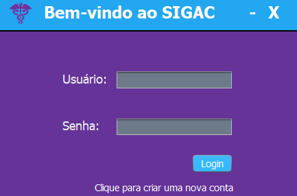

# Sistema Integrado de Gestão de Atividades Clínicas - SIGAC
Trabalho final da disciplina Técnicas de Programação 1

O acesso a saúde é um direito fundamental do ser humano e é garantido pela nossa 
constituição. Embora nos últimos anos os sistemas de saúde tenham se
modernizado, ainda é comum a demora e ineficiência no atendimento em hospitais e
clínicas, sejam eles públicos ou particulares. Para auxiliar no atendimento e fluxo de
trabalho de clínicas, surgiram softwares de gestão médica que utilizam a
computação como ferramenta para agilizar o atendimento. Tais softwares
usualmente integram diversos módulos, cada um responsável por uma dimensão da
administração de uma clínica (RH, atendimentos, pedidos de exames, etc.).

O presente trabalho propõe o desenvolvimento de um software desktop de gestão
de clínicas. O software SIGAC foi feito em java e desenvolvido juntamente com [Enzo Yoshio](https://github.com/enzoyoshio) e [Pedro Maschio](https://github.com/pedro-maschio)

